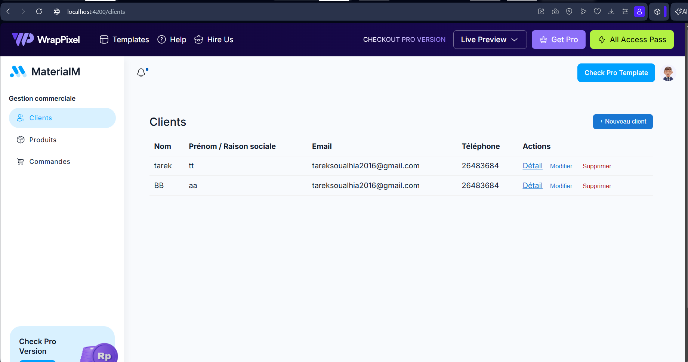
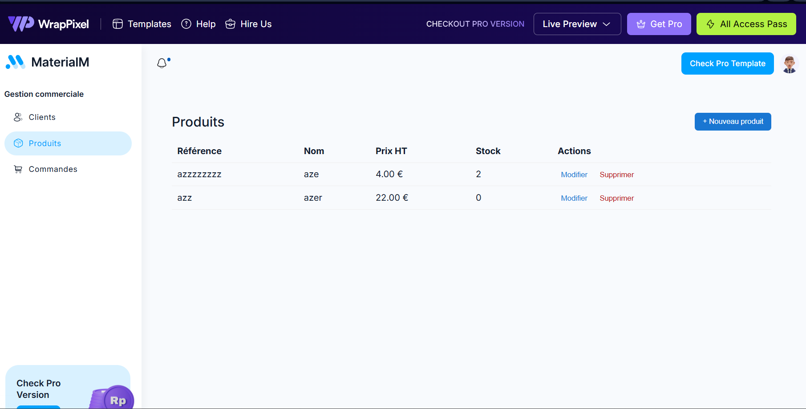
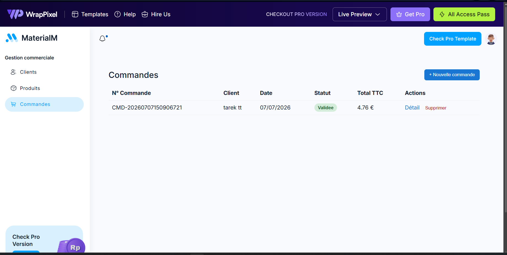

# Mini Projet de Gestion Commerciale

Application de gestion commerciale permettant de gérer les clients, les produits et les commandes, avec calcul automatique des totaux et gestion du stock.

## Stack technique

- **Back-end** : .NET 8 (ASP.NET Core Web API)
- **Front-end** : Angular 19
- **Base de données** : SQL Server (Express)
- **ORM** : Entity Framework Core

## Prérequis d'installation

Avant de lancer le projet, assurez-vous d'avoir installé :

- [.NET 8 SDK](https://dotnet.microsoft.com/download/dotnet/8.0)
- [Node.js](https://nodejs.org/) (version LTS recommandée) et npm
- [Angular CLI](https://angular.dev/tools/cli) : `npm install -g @angular/cli`
- [SQL Server Express](https://www.microsoft.com/en-us/sql-server/sql-server-downloads) (ou une autre instance SQL Server accessible)
- Un IDE tel que [VS Code](https://code.visualstudio.com/)

Vérifiez vos installations avec :
```bash
dotnet --version
node --version
npm --version
ng version
```

## Étapes pour lancer le back-end

1. Ouvrir un terminal dans le dossier `backend/GestionCommerciale.Api`

2. Configurer la chaîne de connexion dans `appsettings.json` si nécessaire (par défaut, elle pointe vers une instance locale `SQLEXPRESS`) :
```json
"ConnectionStrings": {
  "DefaultConnection": "Server=localhost\\SQLEXPRESS;Database=GestionCommercialeDb;Trusted_Connection=True;TrustServerCertificate=True"
}
```

3. Restaurer les dépendances :
```bash
dotnet restore
```

4. Appliquer les migrations pour créer la base de données :
```bash
dotnet ef database update
```
> Si `dotnet ef` n'est pas reconnu, installez l'outil globalement :
> ```bash
> dotnet tool install --global dotnet-ef
> ```

5. Lancer l'API :
```bash
dotnet run
```

6. L'API sera disponible sur `http://localhost:5177` (le port exact s'affiche dans le terminal). La documentation Swagger est accessible sur :
```
http://localhost:5177/swagger
```

## Étapes pour lancer le front-end

1. Ouvrir un terminal dans le dossier `frontend/gestion-commerciale` (ou le nom de votre dossier Angular)

2. Installer les dépendances :
```bash
npm install
```

3. Vérifier que l'URL de l'API dans les fichiers services (`src/app/services/*.service.ts`) correspond bien au port du back-end (par défaut `http://localhost:5177/api/...`)

4. Lancer l'application :
```bash
ng serve
```

5. Ouvrir un navigateur sur :
```
http://localhost:4200
```

## Informations de connexion

L'authentification n'a pas été implémentée dans cette version du projet — l'accès aux pages et à l'API est libre, conformément au cahier des charges (l'authentification étant optionnelle/bonus).

## Structure du projet

```
GestionCommerciale/
├── backend/
│   └── GestionCommerciale.Api/
│       ├── Controllers/     # Endpoints REST (Clients, Products, Orders)
│       ├── Models/          # Entités (Client, Product, Order, OrderLine)
│       ├── DTOs/            # Objets de transfert de données
│       ├── Services/        # Logique métier
│       ├── Data/            # DbContext EF Core
│       └── Migrations/      # Migrations de base de données
├── frontend/
│   └── gestion-commerciale/
│       └── src/app/
│           ├── pages/       # Clients, Produits, Commandes
│           ├── services/    # Services HTTP Angular
│           └── models/      # Interfaces TypeScript
├── docs/
│   └── screenshots/         # Captures d'écran de l'application
└── README.md
```

## Fonctionnalités principales

- **Clients** : liste, création, modification, suppression, consultation du détail
- **Produits** : liste, création, modification, suppression, gestion du stock
- **Commandes** : création avec plusieurs lignes de produits, calcul automatique du total HT/TTC (TVA 19%), validation avec mise à jour automatique du stock, consultation du détail

## Règles de gestion implémentées

- Une commande ne peut pas être créée sans client
- Une ligne de commande ne peut pas avoir une quantité ≤ 0
- Impossible de commander une quantité supérieure au stock disponible
- Le stock est automatiquement décrémenté lors de la validation d'une commande
- Le total TTC est calculé avec une TVA fixe de 19%

## Captures d'écran

### Liste des clients


### Liste des produits


### Liste des commandes

